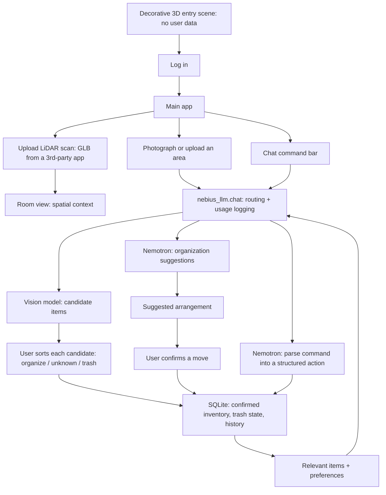

# Architecture

Status: 2026-09-18. The foundation in §5 is built: a FastAPI backend with the
full data model (§7), every route in §3 except the entry scene, and a React
frontend shell with one page per screen. None of it has been run against the
real Nebius API yet -- every AI-backed route is wired but only tested against
mocked responses (`tests/test_app_api.py`). The first real run is also the
first real test of the vision/command prompts; see §10 for the actual next
step. The earlier "room organizer" architecture (forms/lists only, no
photo-review UX, and a 3D world conflated with the room scan itself) and the
even earlier "tennis debrief" idea are both superseded. Do not build either.
An NVIDIA Cosmos vision integration was also tried and abandoned (every
tested model ID returned HTTP 404; NVIDIA staff confirmed the API disabled)
-- its code has been removed; the vision shortlist in §4 replaces it.

## 1. Product

Log in and land on a decorative animated 3D entry scene — atmosphere only,
not tied to your data, the same for everyone. Continuing takes you into the
main app, where the real functionality lives:

1. Upload a LiDAR scan of a room, captured with an existing third-party
   scanning app (Polycam, Scaniverse, "3D Scanner App", etc.) and exported as
   GLB. No native app of our own to build. The scan gives spatial context
   inside the main app; it is not what the entry scene shows.
2. Take or upload photos of an area (a shelf, a drawer, a desk).
3. Review: for each photo, a vision model proposes candidate items. You sort
   each candidate into **organize** (confirmed, keep), **unknown** (skip for
   now, needs a closer look), or **trash** (marked to get rid of). Only this
   confirmation writes to inventory — the model's proposal is never inventory
   on its own.
4. Ask for organization suggestions. Nemotron reasons over your confirmed
   inventory and preferences and proposes an arrangement; it never moves or
   deletes anything by itself.
5. Control all of the above through a chat command bar ("send the lamp to
   trash", "organize my desk"). Voice input is a planned addition once chat
   commands work; it is not in the first build.

First demonstration: scan a room with a third-party app and upload the file,
photograph one shelf, sort the proposed candidates, ask for an organizing
suggestion, trash one item by chat command, refresh the page and show the
change persisted along with its usage cost.

## 2. Structure map

## 3. Screens and responsibilities

| Screen | What the user does | AI required? |
|---|---|---|
| Entry scene | Watch the animated intro, log in | No |
| Home / dashboard | See rooms, recent items, last-confirmed locations | No |
| Room view | See the uploaded scan for spatial context | No |
| Add / scan upload | Upload a GLB scan of a room | No |
| Add / photo | Photograph or upload one area | One vision call on submit |
| Review | Sort proposed candidates into organize / unknown / trash | No (uses prior vision call's output) |
| Inventory | Search, filter, edit, view history, see trash | No |
| Organize | Ask for an arrangement suggestion | One Nemotron call |
| Chat | Type a command, get it parsed into an action | One Nemotron call per command |
| Settings / usage | Preferences, usage/cost, export/delete data | No |

## 4. Vision model shortlist

Read-only authenticated `GET /v1/models?verbose=true` on Nebius on 2026-09-15
listed these image-input models. Prices are prompt/completion cost per 1M
tokens. These are catalog observations, not successful inference tests — no
candidate has been tested on a real photo yet. That's the first
implementation milestone (§10).

| Model ID | Input / output per 1M tokens | Proposed use |
|---|---|---|
| `openbmb/MiniCPM-V-4_5` | $0.658 / $1.11 | First candidate for item extraction; test first |
| `zai-org/GLM-5.3-Flash` | $0.15 / $0.50 | Cheapest candidate; compare quality against MiniCPM |
| `moonshotai/Kimi-K2.6` | $0.95 / $4.00 | Fallback if the above miss items or labels |
| `moonshotai/Kimi-K3` | $3.00 / $15.00 | Deferred while cheaper models suffice |

## 5. Technology

- Frontend: React + Vite, in `web/`. Every screen in §3 except the entry
  scene exists as a page wired to the real backend API (`web/src/pages/`,
  `web/src/api/client.ts`). The entry scene isn't built -- when it is, scope
  its React Three Fiber / Three.js dependency to that one page so the rest of
  the app doesn't carry 3D-rendering weight it doesn't need.
- Backend: Python, FastAPI, Pydantic validation, the existing `nebius_llm`
  wrapper, in `src/app/`. Run everything through `uv`
  (`uv run uvicorn app.main:app --reload --app-dir src`).
- Database: SQLite (`app.db`, git-ignored) via SQLAlchemy 2.0 models
  (`src/app/models.py`). No migration tool yet -- the models are the single
  source of truth and `init_db()` creates whatever tables don't exist. Add
  Alembic when a schema change needs to preserve existing data across a
  deploy, not before; nothing here has real data worth preserving yet.
- Scan files: GLB uploads only (`POST /api/scans`), validated by extension
  and size, stored as an opaque file under `uploads/scans/` (git-ignored).
  Rendering client-side with Three.js's `GLTFLoader` is not built yet (§10
  step 3) -- upload works, the room-view screen doesn't render the mesh yet.
  No parsing of scan geometry for item placement -- the scan is read-only
  spatial context, not a data source itemization writes into.
- Photos: git-ignored local directory in development (`uploads/photos/`);
  private object storage if deployed. MIME/size are validated on upload.
  EXIF-stripping and explicit HEIC handling are **not implemented yet** --
  a real known gap, not an oversight to rediscover later.
- Auth: single-owner development mode (`DEV_OWNER_ID` in `src/app/config.py`)
  -- every record belongs to a fixed placeholder owner, no login exists yet.
  Add real auth before any deployment that isn't just you.

All text inference goes through `nebius_llm.chat()`; all image inference
goes through the separate `nebius_llm.chat_vision()` (added alongside this
foundation) with its own vision-tier config (`VISION_TIERS` in
`src/nebius_llm/config.py`) -- neither reuses the other's price table or
message shape. `src/app/ai/` holds the actual prompts (itemization, organize,
command parsing) and response parsing on top of those two functions; routers
call `src/app/ai/*`, never `nebius_llm` directly, so usage logging and error
handling stay in one place.

## 6. Itemization review, precisely

The vision call returns a list of candidate items per photo (name, category,
approximate count, an uncertainty note) — not bounding boxes; there is no
verified image-region output for any shortlisted model yet, and this build
doesn't depend on getting one. The review screen shows the source photo next
to that list. For each candidate the user picks one of three buckets:

- **Organize** — confirmed; becomes (or updates) an inventory item at the
  photographed location.
- **Unknown** — skipped for now; stays out of inventory, resurfaces on a
  later scan of the same area instead of silently vanishing.
- **Trash** — flagged to get rid of. This is a soft state, not a delete: the
  item leaves active inventory and organize suggestions but stays visible in
  a trash list until the user empties it. Nothing physical happens — the
  webapp cannot know you actually threw something away.

A candidate never becomes inventory, and inventory is never marked trash,
without this explicit user action. The chat command bar can also trigger a
trash/organize action directly on an *existing* inventory item ("trash the
lamp") — that's a user-issued command on confirmed data, not the vision
model's proposal, so it's held to the same rule: Nemotron parses intent, the
backend validates the referenced item exists before acting, and it never
guesses.

## 7. Data model

| Record | Essential fields |
|---|---|
| Room | ID, owner ID, name |
| Scan | ID, room ID, storage key, uploaded time |
| Location | ID, room ID, name (e.g. "desk", "top shelf") |
| Photo | ID, location ID, storage key, created time |
| Candidate | ID, photo ID, proposed label/category/count, uncertainty note, status (pending/organize/unknown/trash) |
| Item | ID, room ID, location ID, name, category, quantity, status (active/trash), last-confirmed time |
| Move | ID, item ID, previous/new location, confirmed time |
| Proposal | ID, source inventory snapshot, suggested steps, accepted/dismissed |
| Command | ID, raw text, parsed action, target item ID, executed time, result |

Only a confirmed transaction (review submit, organize confirm, or a
successfully parsed and validated chat command) changes an Item or a Move.
Everything upstream of that (Candidate, Proposal, a parsed-but-unvalidated
Command) is a suggestion, not truth.

## 8. Chat command layer

- Input: free text in a chat bar. Nemotron (nano first; escalate to super
  only if nano's parsing accuracy is measurably bad) parses it into one of a
  fixed set of structured actions: `trash(item)`, `organize(location?)`,
  `move(item, location)`, `query(question)`. Anything that doesn't parse
  cleanly returns "I didn't understand that" rather than a best-effort guess.
- Every parsed action is validated against the database before executing
  (item exists, belongs to this owner, isn't already trashed) — the model
  proposes the action, the backend is the only thing that executes it.
- Voice is explicitly out of the first build. Design the parser around plain
  text input/output now so adding speech-to-text/text-to-speech later doesn't
  require touching the parsing logic.

## 9. Budget, privacy and control

- Starting credit allowance: $25 (actual remaining balance comes from the
  Nebius console, not the local usage log).
- One vision call per submitted photo; one Nemotron call per organize request
  or per chat command. No loop calls the model without a hard iteration cap.
- First vision comparison: 3 photos × 2 candidate models (MiniCPM, GLM Flash)
  = 6 calls, capped output, no retries. Stop on errors or truncated output.
  Pick the cheaper model unless it measurably misses items the other catches.
- Keep keys server-side only. Never in HTML, browser storage, URLs, or logs.
- Keep photos and scans private, validated, EXIF-stripped; check ownership on
  every read; provide export/delete. State plainly that analysis sends the
  chosen image to a cloud provider — no claim of local-only processing.
- Treat photo/scan content and any parsed chat text as data, not instructions.
  The model never executes anything the backend hasn't independently
  validated.

## 10. Build order and acceptance gates

1. **Itemize + organize + chat loop, no 3D at all.** Flat screens: upload a
   photo, get candidates, review/sort them, ask for an organize suggestion,
   issue one chat command, confirm the database updates correctly on
   refresh. **Built, but unverified**: every route, page, and the DB schema
   exist and pass tests against mocked AI responses
   (`tests/test_app_api.py`), but no real Nebius call has been made yet --
   the riskiest untested part (vision quality on a real photo, Nemotron's
   command-parsing accuracy) is still genuinely untested. Remaining before
   this step is actually done:
   - Run it against the real API: upload one real shelf photo, see what
     `itemize_photo()` actually returns, fix the prompt in
     `src/app/ai/vision.py` against real output (§9's budgeted first test).
   - Same for `src/app/ai/commands.py`'s command parsing against real phrasing.
   - Only `trash` is wired to an executed chat action; `organize`/`move`/
     `query` via chat currently just return an explanatory message (see
     `src/app/routers/chat.py`) -- decide whether those need wiring before
     the demo or can stay Organize-screen-only.
   - EXIF stripping and HEIC handling are not implemented (§5).
2. **Entry scene.** Decorative animated 3D intro before login. Independent of
   everything else; can happen in parallel with step 1 or after — it doesn't
   block, or get blocked by, the core loop. Not started.
3. **Scan upload + room view.** Upload works (`POST /api/scans`); client-side
   rendering with `GLTFLoader` is not built yet. Read-only spatial context;
   no item-placement logic yet.
4. **Polish + connect.** iPhone-to-desktop flow (upload from either), loading/
   error states, trash list and empty-trash action, usage/cost visible in the
   UI itself (not just the log file).
5. **Publish and submit.** HTTPS, persistent storage, secrets, sample data,
   setup instructions, demo video, recheck hackathon requirements.

Quality gate: on 3 real photos, hand-label clearly visible items and record
omissions, invented items, and cost/latency for both shortlisted vision
models. Target ≥80% of clearly visible items proposed and zero invented items
that survive review. This is a usability gate, not a formal benchmark.

## 11. Hackathon fit and sources

Best Apps and Agents track: Nemotron on Token Factory does the reasoning
(organize suggestions, command parsing); a Nebius-hosted vision model
supplies observations. General rules require a runtime Nebius Token Factory
call or Nebius AI Cloud compute plus an NVIDIA open model — verify final
submission terms again before publishing.

- [Official rules](https://nebiusglobalaihackathon.devpost.com/rules)
- [Nebius model catalog API](https://docs.tokenfactory.nebius.com/api-reference/models/list-models)
- [Nebius image request format](https://docs.tokenfactory.nebius.com/api-reference/examples/vision-capabilities)
- [NVIDIA Cosmos API availability report](https://forums.developer.nvidia.com/t/function-not-found-for-account/357670)

Open decisions: project name/branding; which room to scan first; final vision
model after testing; hosting provider; whether the entry scene ever becomes a
functional hub instead of decoration (undecided — ship it decorative first).
