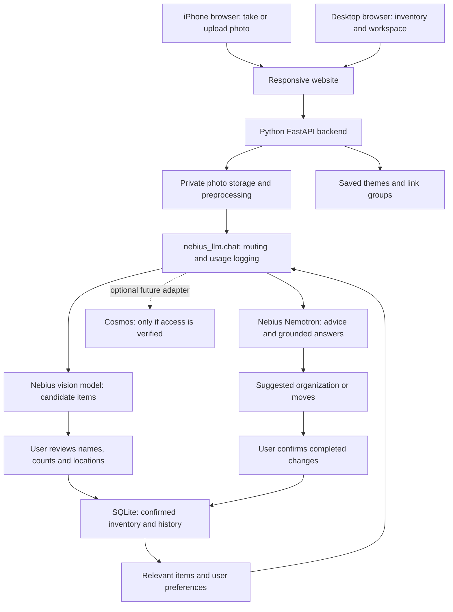

# Room organizer: proposed architecture

Planning snapshot: 2026-09-15. This is a proposed build plan, not an implemented app.
David requested a full structure map. Build and verify one milestone at a time.

## 1. Product and first demonstration

A personal website that helps you remember where your belongings are and organize
them around how you use your room. Your iPhone supplies photos; your desktop and
phone share the same inventory. Nemotron turns confirmed inventory and your
preferences into useful organization advice.

First demonstration: photograph a desk shelf, confirm/edit the suggested items,
save them under Bedroom > Desk > Top shelf, ask where the charging cable is, ask
for a tidier arrangement, and confirm one move. Refresh the page to show that the
new location persists. Show the model usage and estimated cost.

The website records observations and your confirmations. It cannot know that an
object moved off-camera. Answers say "last confirmed" with a date, not "currently"
unless you just verified the location. It does not infer what is inside a closed
drawer or guarantee exact counts from cluttered photos.

## 2. Structure map

## 3. Pages and responsibilities

| Page | What the user does | AI required? |
| --- | --- | --- |
| Home | See room cards, recent items and last confirmed locations | No |
| Add / scan | Choose room and storage area, photograph or upload one image | One vision call after pressing Analyze |
| Review scan | Rename, remove, add or merge items; correct counts and locations | No |
| Inventory | Search, filter, edit items, move items, see history | No for normal search |
| Ask / organize | Ask about belongings or request an arrangement | One Nemotron call using selected records |
| Workspace modes | Save icons, colors, backgrounds and groups of links | No for ordinary mode activation |
| Settings / usage | Set preferences, inspect estimates, delete/export data | No |

Make inventory and review work before adding workspace customization. The product
identity can connect physical and digital routines later: a Study mode shows
study links plus the last saved location of your headphones and notebook.

## 4. Model choices: what is actually known

Read-only authenticated `GET /v1/models?verbose=true` on Nebius on 2026-09-15
advertised the following image-input models. Prices below are the returned prompt
and completion token prices converted to USD per one million tokens. These are
catalog observations, NOT successful inference tests or guaranteed photo costs.

| Model ID | Input / output per 1M tokens | Proposed use |
| --- | --- | --- |
| `openbmb/MiniCPM-V-4_5` | $0.658 / $1.11 | First candidate for item extraction; compare on real shelf photos |
| `zai-org/GLM-5.3-Flash` | $0.15 / $0.50 | Cheapest advertised candidate; compare quality before choosing |
| `moonshotai/Kimi-K2.6` | $0.95 / $4.00 | Alternative when the first candidates miss items or labels |
| `moonshotai/Kimi-K3` | $3.00 / $15.00 | Listed vision alternative; defer while cheaper models suffice |

No candidate has been tested on a photo in this repo. Prefer MiniCPM as the first
test, then GLM Flash on the same image. Choose the cheapest model that meets the
review-quality target; model size or marketing alone does not decide quality.

Nebius's website also mentions Qwen2.5-VL, but it is absent from the current key's
catalog. Qwen3.5 is listed with a multimodal description but `text->text` endpoint
metadata. Neither is a confirmed image-input option for this setup.

Nemotron stays central: the existing nano route handles inventory questions and
organization suggestions. Use Super only if measured quality needs it. Ultra
is an explicit, bounded experiment for difficult planning, not the default.

Cosmos remains an optional replacement vision adapter. The tested NVIDIA API
returns 404; no local installation, rented GPU or usable hosted inference has
been established. The rest of the app must work without it.

## 5. Proposed technology and deployment

- Frontend: responsive HTML, CSS and small JavaScript modules served by FastAPI.
  Start without a large frontend framework; this keeps one server and fits the
  existing Python project. Add an installable web-app manifest later if useful.
- Backend: Python FastAPI, Pydantic request/response validation, existing model
  wrapper. Install dependencies with uv and run Python through uv.
- Database: SQLite for the initial single-server demo. Use migrations. Introduce
  PostgreSQL if multi-instance hosting or substantial multi-user traffic requires it.
- Photos: ignored private local directory in development. Use a persistent private
  volume for a one-server demo or private object storage when deploying separately.
- Browser sessions: single-owner development first; authentication and per-owner
  access checks before any public deployment with personal room photos.
- Hosting: choose after the local end-to-end workflow works. Needs HTTPS, persistent
  storage and server-side secrets. Hosting/storage charges are separate from model
  credits. Do not assume Nebius Token Factory hosts the website itself.

All image and text inference must pass through `nebius_llm.chat()`. Extend it with
an explicit vision route and image-message support, model-specific supported
parameters, prices and output validation. Do not swap a vision ID into the nano
configuration: its prices and Nemotron-specific options would then be wrong.
This gateway extension is proposed work, not already implemented.

## 6. iPhone and desktop workflow

1. Open the same website on both devices and use the same account/workspace.
2. On the phone, select a storage area and use a photo picker/camera capture input.
   Start with one photo at a time and retain normal file upload as a fallback.
3. Show a preview and an explicit Analyze button before sending the image.
4. Upload to the backend; validate and normalize rotation, strip location metadata,
   resize to a sensible limit, and convert supported inputs to JPEG/PNG. Handle
   iPhone HEIC explicitly or explain how to supply JPEG; never silently reject it.
5. Phone or desktop reviews the result. Desktop refresh/polling shows saved items;
   real-time video streaming is unnecessary for the first version.

No webcam connection cable or special camera app is needed for this design.
For direct browser camera preview, `getUserMedia()` requires permission and a secure
context. A phone opening a desktop's plain HTTP LAN address is not localhost;
use HTTPS for that feature. First test can simply transfer a photo to the desktop.

## 7. Data model and truth rules

| Record | Essential fields |
| --- | --- |
| Workspace / owner | ID, owner ID, preferences, theme |
| Location | ID, workspace ID, parent ID, name, kind (room/shelf/drawer/bin) |
| Photo | ID, workspace ID, storage key, location ID, created time, retention choice |
| Scan | ID, photo ID, model, status, candidate JSON, usage reference, error code |
| Item | ID, workspace ID, name, category, attributes, quantity, location ID, last confirmed time |
| Observation | ID, item ID, photo/scan ID, observed time; evidence distinct from confirmed truth |
| Move | ID, item ID, previous/new location, confirmed time |
| Proposal | ID, source inventory revision, suggested steps, accepted/dismissed state |
| Mode | ID, name, icon, colors/background, user-saved links, related item IDs |

Candidate fields: label, category, visible attributes, approximate count and
uncertainty notes. Optional image regions can come later; no promise of accurate
boxes or measurements. Model confidence numbers are not calibrated probabilities.

Only the user-confirmed transaction creates inventory or changes a location.
Rescans propose matches and duplicates for review; they never automatically delete
missing objects. An item not visible may simply be occluded. Preserve IDs through
renames and moves. Reject cross-workspace references and stale revisions.

Embeddings are optional later: encode confirmed text descriptions to find related
items when exact search fails. They neither identify objects on their own nor
provide reliable identity tracking. Start with category/name filters and database
search. Any future embedding route needs the same central usage accounting policy;
do not add an unlogged SDK shortcut or a vector database prematurely.

## 8. Backend interfaces and failure behavior

Proposed routes (not implemented):

- `POST /api/scans`: validate one image/location, create bounded scan request.
- `GET /api/scans/{id}`: pending, processing, ready for review, or failed.
- `POST /api/scans/{id}/confirm`: atomically save reviewed candidates; duplicate
  submissions use an idempotency key and do not create duplicate items.
- `GET /api/items`, `PATCH /api/items/{id}`, `POST /api/items/{id}/moves`.
- `POST /api/organize`: retrieve bounded relevant inventory, call Nemotron once,
  validate proposed item/location IDs and return advice without executing moves.
- `POST /api/ask`: retrieve relevant confirmed items; explicitly say when evidence
  is absent rather than inventing a location.
- CRUD routes for locations/modes; usage summary and data export/delete routes.

Use a small persisted job table and one worker for scans if latency makes a direct
request fragile. A restarted in-flight job becomes interrupted; it is not silently
replayed at additional cost. Timeouts and rate limits return clear UI states. Keep
manual inventory entry usable during provider failures. Reject invalid model JSON
or offer manual review; do not loop until output is valid.

## 9. Budget, privacy and control

- Starting credit allowance: $25; actual remaining balance must come from the
  console. The repo's estimated log is not a complete billing receipt.
- Proposed allocation: $2 experiments, $8 implementation checks, $5 demo rehearsal,
  $10 reserve. Reconcile with prior spending before enforcing these amounts.
- One vision call per explicitly submitted scan; organization is a separate user
  action with one nano call. Initial tests: one photo, capped output, retries=0.
- Proposed first comparison cap: 3 photos x 2 models = 6 requests, with a $0.25
  estimated batch ceiling. Stop on errors, excessive reasoning or truncated output.
- Before implementation calls, verify supported image format and output/reasoning
  parameters. Missing usage or unknown image billing means unknown cost, not zero.
- Example only: 2,000 billable input tokens plus 500 output tokens costs about
  $0.001871 on MiniCPM or $0.00055 on GLM Flash at the catalog rates. Image token
  counts and reasoning can change actual cost; these are not per-photo quotes.
- Budget checks must reserve estimated in-flight costs and include retry attempts.
  Log failures and timeouts as potentially unreported spend. Use server rate limits
  and per-session quotas so a public demo cannot consume the whole balance.
- Keep keys server-side. Never put keys in HTML, browser storage, URLs or logs.
- Keep photos private, validate MIME/content and size, strip EXIF, check ownership
  on every read, and provide delete/export. Explain that analysis sends the chosen
  image to a cloud provider. Do not claim fully local processing or zero retention.
- Treat image text and retrieved web pages as data, not instructions. Models do not
  run commands, browse arbitrary URLs or alter inventory without confirmation.

## 10. Optional features after the core works

| Feature | Practical first version | Later / unresolved |
| --- | --- | --- |
| Custom identity | User-selected icon, colors and background | Generated designs and richer layouts |
| Work/study modes | Saved link cards and associated belongings | Multiple automatic tabs can hit popup restrictions; explicit links are reliable |
| Desktop actions | None required for MVP | Opening native apps or changing OS settings needs a separate permissioned helper/extension |
| Virtual room | Hierarchical room/location cards | Floor plan and editable layout; true 3D reconstruction is a separate project |
| Projector | Display the website as a second monitor | Interactive projection needs tracking/input and calibration; a projector alone does not add touch |
| Tavily | Optional research for storage methods or products, with citations | User supplies dimensions/budget; do not send private room photos to search |
| Cosmos | Adapter slot in the vision pipeline | Only after a callable endpoint, cost and photo test are verified |

Tavily is web research, not inventory memory. Its prize requires a functional
runtime Tavily API call as part of the solution; adding a logo or stored links is
not enough. Keep it out of the critical path until it solves a demonstrated need.

## 11. Build order and acceptance gates

### Evaluated optional tool: TensorRT Model Connect

Reviewed NVIDIA's repository and current documentation on 2026-09-15. This is an
experimental tool for building supported model checkpoints into TensorRT bundles
and running them on NVIDIA hardware. It does not provide hosted API access or
remove GPU memory requirements. It adds no direct benefit to our Token Factory
API calls, whose model execution is managed by Nebius.

A possible later use is a local vision service: supported object detectors such
as DETR/YOLO find candidate objects, SAM supplies prompted masks, or the listed
Nemotron image/text embedding model supports similarity search. These are distinct
tasks; none alone provides the complete room inventory and reasoning workflow.
Our RTX 5080 compatibility, memory use and latency would need an actual test of
the selected checkpoint. Do not assume all declared recipes run on 16 GB VRAM.

Current documented installation paths are Linux. x86_64 requires a source build
with Docker and NVIDIA Container Toolkit; no x86_64 release wheel is published.
There is no documented native Windows quick path on the system-requirements page.
The model list includes Cosmos3-Nano image generation, which does not establish
support for the Cosmos Reason endpoint we tried. Keep this tool outside the MVP;
revisit only when local processing or inference speed becomes a measured need.

Sources: [repository](https://github.com/NVIDIA/TensorRT-Model-Connect),
[supported recipes](https://nvidia.github.io/TensorRT-Model-Connect/models-recipes/overview/),
[system requirements](https://nvidia.github.io/TensorRT-Model-Connect/getting-started/environment-and-repro/).

1. **Vision proof:** extend the logged gateway, analyze one non-sensitive shelf
   photo, print actual labels/tokens/latency/cost. Compare two candidates within the
   cap; pick a model only after usable output. No UI dependency until this passes.
2. **Inventory foundation:** locations, manual items, persistence, confirmed moves
   and basic search. Restart and verify saved records remain correct.
3. **Photo review:** upload, scan, editable candidates and explicit confirmation.
   Test iPhone input, duplicates, rotation, unsupported files and provider failure.
4. **Nemotron workflow:** grounded item lookup and an organization plan referencing
   real item/location IDs. Test unknown items, stale locations and rejected moves.
5. **Connected website:** phone and desktop share the same records; polish loading,
   error and review states. Verify account isolation before public access.
6. **Identity and modes:** add a small theme editor and saved link groups if time
   remains. Demonstrate a useful connection to the room-organizing workflow.
7. **Publish and submit:** HTTPS, persistent storage, secrets, quotas, sample data,
   setup instructions and demo video. Recheck hackathon requirements and terms.

Proposed quality check: on three photos, hand-label clearly visible objects and
record omissions, invented items, corrections, latency and cost. Target at least
80% of clearly visible items identified and zero invented items saved after review.
This is a small usability gate, not a scientific benchmark or accuracy guarantee.

## 12. Hackathon fit and sources

Best Apps and Agents is the proposed track: Nemotron on Token Factory performs the
core reasoning while a separate vision model supplies observations. The general
rules require a runtime Nebius call or Nebius compute plus an NVIDIA open model.
The track explicitly calls for Nemotron on Token Factory. Verify final submission
details again before publishing; do not rely on the obsolete tennis sections of
HANDOFF.md as current product requirements.

- [Official rules](https://nebiusglobalaihackathon.devpost.com/rules)
- [Nebius model catalog API](https://docs.tokenfactory.nebius.com/api-reference/models/list-models)
- [Nebius image request format](https://docs.tokenfactory.nebius.com/api-reference/examples/vision-capabilities)
- [Nebius vision overview](https://nebius.com/solutions/vision)
- [NVIDIA Cosmos API availability report](https://forums.developer.nvidia.com/t/function-not-found-for-account/357670)
- [Browser camera requirements](https://developer.mozilla.org/en-US/docs/Web/API/MediaDevices/getUserMedia)

Open decisions: name/logo and visual style; which room to test first; final vision
model after testing; photo retention preference; hosting provider; whether Tavily
or workspace modes add enough value for the first demo. Suggested defaults above
let us proceed one milestone at a time without committing to later features.
